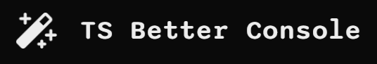
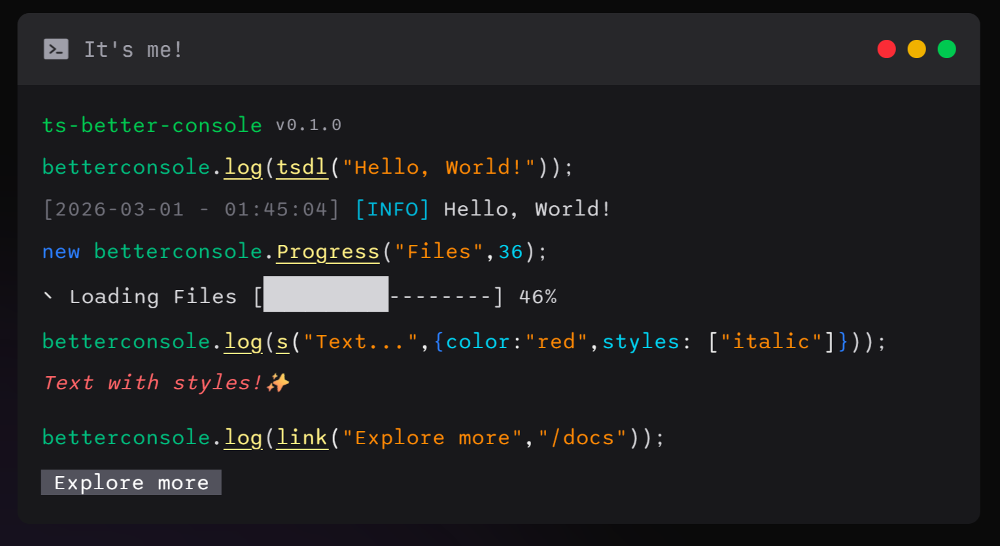

# ts-better-console

A small TypeScript library for making your terminal output actually look good. Colored text, progress bars, interactive menus, clickable buttons — all without pulling in a dozen dependencies.

### [Read More / Documentation](https://ponlponl123.github.io/ts-better-console)



## Install

```bash
# npm
npm install ts-better-console

# bun
bun add ts-better-console
```

## Quick look

```ts
import betterConsole, {
  s,
  cs,
  flag,
  ts,
  link,
  createCard,
} from "ts-better-console";

// basic logging — strings get styled automatically
betterConsole.log("plain text");
betterConsole.info("this shows up in cyan");
betterConsole.warn("yellow warning");
betterConsole.error("red error");
betterConsole.debug("magenta debug output");

// style anything yourself
console.log(s("bold green text", { color: "green", styles: ["bold"] }));

// combine strings with a separator
console.log(cs(["Hello", "World"], " | ")); // "Hello | World"

// timestamps and debug flags
console.log(ts(true, "server started")); // [2026-03-01 - 14:30:00] server started
console.log(flag("error", "disk full")); // [ERROR] disk full

// clickable terminal links (in supported terminals)
console.log(
  link("open docs", "https://github.com/ponlponl123/ts-better-console"),
);

// pretty-print JSON inside a bordered card
betterConsole.json({ name: "Alice", role: "admin" });
```

## Styled text

The `s()` function is the core of the styling system. Pass a string and a style object — you get back an ANSI-escaped string that renders with color in the terminal.

```ts
import { s } from "ts-better-console";

s("hello", { color: "cyan" });
s("important", { color: "white", backgroundColor: "red", styles: ["bold"] });
s("keeps going...", { color: "green", endless: true }); // no reset at the end
```

Available colors: `black`, `red`, `green`, `yellow`, `blue`, `magenta`, `cyan`, `white`, `gray`

Available styles: `bold`, `italic`, `underline`, `strikethrough`

## Cards

`createCard()` wraps text in a bordered box. Works well for displaying structured output like JSON.

```ts
import { createCard } from "ts-better-console";

const card = createCard("Hello from inside a card!", "auto", {
  title: { content: "Greetings", style: { color: "cyan", styles: ["bold"] } },
  footer: { content: "v0.1.0", style: { color: "gray" } },
  borderStyle: { color: "green" },
});

console.log(card);
```

The width can be a number or `"auto"` to fit the content. Minimum width is 12, and it won't exceed your terminal width.

## Progress bars

Animated progress bars with spinner indicators. Multiple bars render together without flickering.

```ts
import { Progress } from "ts-better-console";

const bar = new Progress("Downloading", 100, {
  barLength: 40,
  label: { while: "Downloading", past: "Downloaded" },
});

bar.on("complete", () => console.log("All done."));
bar.init();

// call bar.update(current) as work progresses
```

Events: `update`, `complete`, `cancel`, `error`

## Interactive menus

Keyboard and mouse-driven selection menus for the terminal.

```ts
import { Menu } from "ts-better-console";

const menu = new Menu(
  [{ label: "Start server" }, { label: "Run tests" }, { label: "Exit" }],
  {
    selectedIcon: "▸",
    unselectedIcon: " ",
    focusStyle: { color: "green", styles: ["bold"] },
  },
);

menu.on("select", (label, index) => {
  console.log(`picked: ${label}`);
  menu.destroy();
});

menu.show();
```

## Buttons

Clickable button rows with hover effects. Supports both mouse clicks and arrow-key navigation.

```ts
import { ButtonGroup } from "ts-better-console";

const buttons = new ButtonGroup([
  {
    label: "Yes",
    onClick: () => console.log("confirmed"),
    style: { color: "white", backgroundColor: "green" },
  },
  {
    label: "No",
    onClick: () => console.log("cancelled"),
    style: { color: "white", backgroundColor: "red" },
  },
]);

buttons.on("click", (label) => buttons.destroy());
buttons.show();
```

## Spinners

Standalone animated spinners with a few built-in styles.

```ts
import { Spinner } from "ts-better-console";

const spinner = new Spinner({ style: "dots" }); // "dots" | "line" | "bounce" | "arrow"
spinner.start();

setTimeout(() => spinner.stop(), 3000);
```

You can also pass your own frames:

```ts
new Spinner({
  frames: ["🌑", "🌒", "🌓", "🌔", "🌕", "🌖", "🌗", "🌘"],
  interval: 150,
});
```

## Utility helpers

| Function                                | What it does                                                        |
| --------------------------------------- | ------------------------------------------------------------------- |
| `cs(strings, join?)`                    | Combine strings with a separator (default: space, `false` for none) |
| `ts(date?, ...args)`                    | Prepend a `[YYYY-MM-DD - HH:MM:SS]` timestamp                       |
| `flag(level, ...args)`                  | Prepend a colored `[INFO]`, `[WARN]`, `[ERROR]`, or `[DEBUG]` badge |
| `tsflag(level, date?, ...args)`         | Timestamp + flag combined                                           |
| `clearStyle(str)`                       | Append the ANSI reset code to a string                              |
| `link(text, url)`                       | Create a clickable hyperlink (OSC 8)                                |
| `createCard(content, width?, options?)` | Render a bordered card                                              |

## Enums and constants

```ts
import { Colors, BackgroundColors, Styles, cls } from "ts-better-console";

// Raw ANSI codes if you need them
console.log(Colors.red + "red text" + cls);
console.log(BackgroundColors.blue + "blue bg" + cls);
console.log(Styles.bold + "bold" + cls);
```

`cls` is just `"\x1b[0m"` — the ANSI reset sequence.

## TypeScript

Everything is fully typed. Key types you can import:

```ts
import type {
  StyleOptions,
  CardOptions,
  CardWidth,
  ProgressOptions,
  ProgressLabelPair,
  ProgressEvents,
  MenuOptions,
  MenuItemOptions,
  MenuEvents,
  ButtonOptions,
  ButtonGroupOptions,
  ButtonGroupEvents,
  SpinnerOptions,
  DebugLevel,
  SectionOptions,
} from "ts-better-console";
```

## Compatibility

Works with Node.js and Bun. Some features (clickable links, mouse events) depend on your terminal emulator supporting the relevant escape sequences.

## License

MIT

## Made with ❤️ by Ponlponl123.

[Buy me a coffee](https://buymeacoffee.com/ponlponl123)
